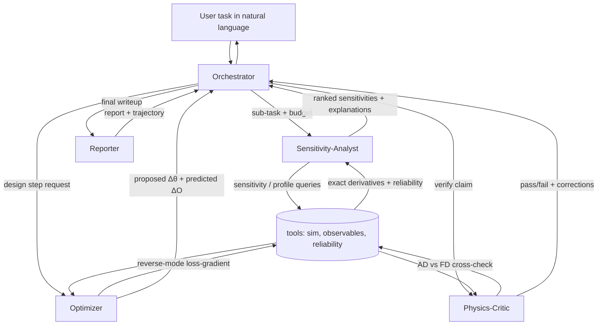

# Agent Architecture

How the orchestrator and subagents collaborate, what tools they call, and how
exact physical derivatives flow through the system. This is the "how the agents
work" design — implement it in `agent/`.

## Design principles

1. **Gradients are a sense, not a side effect.** Every subagent that makes a
   physics claim must back it with a `sensitivity` tool call and check the
   reliability flag before trusting it.
2. **Separation of concerns.** Reasoning (LLM) is separated from computation
   (the deterministic `tools/` layer driving the real binaries). The LLM never
   "computes" a derivative; it *requests* one.
3. **Everything is checkable.** The Physics-Critic re-derives or cross-checks any
   claim the agent commits to, so the final report is consistent with ground
   truth.
4. **Budgeted.** A global step + compute budget (events × runs) from
   `config.yaml` bounds the loop. Subagents request budget; the orchestrator
   grants it.

## Roles



### Orchestrator (`agent/orchestrator.py`)
- Owns the task, the working memory (current design point `θ`, constraints,
  history), and the budget.
- Plans: decompose the task into sub-tasks; route each to a subagent.
- Maintains the **design ledger**: every accepted change to `θ`, the predicted
  vs. realized `ΔO`, and the reliability of the gradient that motivated it.
- Stops when constraints are met, budget is exhausted, or no reliable improving
  direction exists.

### Sensitivity-Analyst
- **Goal:** explain *which* parameters matter for the target observable and *why*.
- **Tools:** `sensitivity(observable, wrt, θ)`, `profile(observable, wrt, θ)`
  (per-layer forward profile), `reliability(...)`.
- **Output:** a ranked table `∂O/∂θ_i` with error bars, reliability flags, and a
  short physical rationale per entry. Flags any sign that contradicts textbook
  expectation (a great hook for the paper).

### Optimizer
- **Goal:** propose the next design step under the active constraints.
- **Tools:** reverse-mode `loss_gradient(loss_spec, θ)` (one pass → all input
  grads), `observe(observable, θ)` to measure realized change, `reliability`.
- **Behavior:** computes a constrained step (projected/clipped to trust region,
  honoring NL constraints compiled into box/linear constraints by the
  orchestrator). Predicts `ΔO` from the gradient; the orchestrator later checks
  realized vs predicted (a built-in honesty metric).
- **Reliability policy:** if `loss_gradient` is `untrusted`, request a
  finite-difference step or more statistics instead of trusting AD.

### Physics-Critic
- **Goal:** independent verification before a decision is committed.
- **Tools:** AD-vs-FD `cross_check(observable, wrt, θ)`, `observe` at perturbed
  points, `reliability`.
- **Behavior:** re-checks the sign/magnitude the Optimizer/Analyst relied on;
  verifies predicted `ΔO` against a fresh measurement; rejects steps built on
  `untrusted` gradients. Emits pass/fail with a reason.

### Reporter
- **Goal:** produce the human-facing writeup + machine trajectory.
- **Tools:** read-only access to the design ledger and tool-call log.
- **Output:** `report.md` (decisions, evidence, final design, residual risks) and
  `trajectory.jsonl` (every tool call + result for reproducibility). Includes a
  **consistency check**: do the report's claimed sensitivities match the logged
  gradients? Fail loudly if not.

## Message / data contract

All subagents speak in terms of `tools/schemas.py` dataclasses:
- `DesignPoint(a, g, energy, n_layers, transverse, particle, ctrl_flags)`
- `Sensitivity(observable, wrt, value, stderr, reliability, method)`
- `Profile(observable, wrt, per_layer_value, per_layer_stderr, reliability)`
- `Observation(observable, value, stderr, design_point)`
- `LossGradient(loss_spec, grad{a,g,energy}, stderr, reliability)`
- `CriticVerdict(passed, reason, checks[])`

Tools are pure functions of `(DesignPoint, query)` → dataclass, cached by flag
hash. This keeps the agent reasoning auditable and the benchmark and agent on one
contract.

## Control loop (orchestrator pseudocode)

```text
load task, constraints, budget, θ0
ledger = []
θ = θ0
while budget remaining and not done:
    plan = LLM_plan(task, ledger, θ, constraints)
    if plan.needs_sensitivities:
        s = SensitivityAnalyst.run(θ, plan.observables)        # tool calls
    if plan.action == "optimize":
        step = Optimizer.propose(θ, plan.loss_spec, constraints) # reverse-mode grad
        verdict = PhysicsCritic.check(θ, step)                   # AD vs FD, ΔO check
        if verdict.passed:
            θ_new = apply(θ, step); realized = observe(θ_new)
            ledger.append(record(θ, step, predicted=step.dO, realized=realized,
                                  reliability=step.reliability))
            θ = θ_new
        else:
            record_rejection(verdict); adapt (more stats / FD / smaller step)
    done = constraints_met(θ) or no_reliable_improving_direction(s)
report = Reporter.write(task, ledger, θ)
assert report.consistent_with(ledger)   # claims match gradients
```

## Reliability-driven behavior (the differentiating mechanism)

| Reliability of gradient | Agent policy |
|-------------------------|--------------|
| `ok` | trust AD; take the gradient step |
| `marginal` | increase statistics (more events/seeds) and re-query; small step |
| `untrusted` | do **not** trust AD; switch to finite-difference, or reason
  qualitatively from physics priors and flag the region |

This table is the operational form of "physics-motivated judgment." It directly
builds on the stop-grad/CRE study: the same regimes that produced unregularized
gradient spikes are the ones the agent learns to distrust.

## Implementation notes

- Keep subagents as **prompt + allowed-tool-set + output schema**; the
  orchestrator dispatches. A subagent is one bounded LLM context with a strict
  toolbelt (see `agent/subagents.py`).
- Start single-process and synchronous. Parallelism (e.g. concurrent
  `sensitivity` calls across parameters) is a later optimization; the `sim` cache
  makes repeated queries cheap.
- The `dry-run` LLM client implements each role with deterministic heuristics
  (rank by |gradient|/stderr; step along the largest reliable gradient) so the
  whole loop runs offline for CI and demos.
- Log **every** tool call to `trajectory.jsonl`. The benchmark and the paper's
  reproducibility both depend on it.
